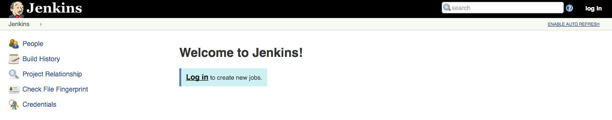

# Build a Continuous Security Scanning Pipeline with Jenkins and Kubernetes

## Introduction

Initial public release at BsidesLv 2018:

Video: TO ADD
Presentation slides: ADD LINK TO .pdf

This guide will take you through the steps necessary to build a security automation framework by converting security tooling into micro services, and using Kubernetes as an orchestration engine in conjection with your favorite CI/CD tool.


The framework also include an easy to deploy AppSec SIEM for tracking/monitoring the continuous scanning activitie along with the developement lifecycle.


For the sake of demonstration, this guidline will us [Google Container Engine](https://cloud.google.com/container-engine/) and [Jenkins](https://jenkins.io) to orchestrate the security scanning activity.

If you are not familiar with basic Kubernetes concepts, have a look at [Kubernetes 101](http://kubernetes.io/docs/user-guide/walkthrough/).

In order to accomplish this goal you will use the following Jenkins plugins:
  - [Jenkins Kubernetes Plugin](https://wiki.jenkins-ci.org/display/JENKINS/Kubernetes+Plugin) - start Jenkins build executor containers in the Kubernetes cluster when builds are requested, terminate those containers when builds complete, freeing resources up for the rest of the cluster
  - [Jenkins Pipelines](https://jenkins.io/solutions/pipeline/) - define our build pipeline declaratively and keep it checked into source code management alongside our application code
  - [GitHub Groovy Libraries](https://github.com/jenkinsci/pipeline-github-lib-plugin) - Allows pipeline Groovy libraries to be loaded on the fly from GitHub.

## Prerequisites
1. A Google Cloud Platform Account
1. [Enable the Compute Engine, Container Engine, and Container Builder APIs](https://console.cloud.google.com/flows/enableapi?apiid=compute_component,container,cloudbuild.googleapis.com)

## Kubernetes and Jenkins Setup

Clone the lab repository in your cloud shell using the following link :

<p>
  <a target="__blank" href="https://console.cloud.google.com/cloudshell/open?git_repo=https://github.com/TmmmmmR/sec_automation&page=editor&open_in_editor=index.js"></a>
</p>

### Create a Kubernetes Cluster
You'll use Google Container Engine to create and manage your Kubernetes cluster. Provision the cluster with `gcloud`:

```shell
gcloud container clusters create jenkins-cd \
--num-nodes 2 \
--machine-type n1-standard-2 \
--scopes "https://www.googleapis.com/auth/projecthosting,cloud-platform"
```

Once that operation completes download the credentials for your cluster using the [gcloud CLI](https://cloud.google.com/sdk/):
```shell
gcloud container clusters get-credentials jenkins-cd
Fetching cluster endpoint and auth data.
kubeconfig entry generated for jenkins-cd.
```

Confirm that the cluster is running and `kubectl` is working by listing pods:

```shell
kubectl get pods
No resources found.
```
You should see `No resources found.`.

### Configure and Install Jenkins
We will use a custom [values file](jenkins/values.yaml) to add the GCP specific plugin necessary to use service account credentials to reach your Cloud Source Repository.

1. Use the Helm CLI to deploy the chart with your configuration set.

```shell
    helm install -n cd stable/jenkins -f jenkins/values.yaml --version 1.2.2 --wait
```

1. Once that command completes ensure the Jenkins pod goes to the `Running` state and the container is in the `READY` state:

```shell
    kubectl get pods
    NAME                          READY     STATUS    RESTARTS   AGE
    cd-jenkins-7c786475dd-vbhg4   1/1       Running   0          1m
```
    
1. Configure the Jenkins service account to be able to deploy to the cluster. 

```shell
    kubectl create clusterrolebinding jenkins-deploy --clusterrole=cluster-admin --serviceaccount=default:cd-jenkins
    clusterrolebinding.rbac.authorization.k8s.io/jenkins-deploy created
```

1. Run the following command to setup port forwarding to the Jenkins UI from the Cloud Shell

```shell
    export POD_NAME=$(kubectl get pods -l "component=cd-jenkins-master" -o jsonpath="{.items[0].metadata.name}")
    kubectl port-forward $POD_NAME 8080:8080 >> /dev/null &
```

1. Create a persitance volume to share scanning results between containers and the [ELK stack](http://insertlinkhere).

```shell
    kubectl create -f jenkins/pv.yaml
```

### Connect to Jenkins

1. The Jenkins chart will automatically create an admin password for you. To retrieve it, run:

```shell
    printf $(kubectl get secret cd-jenkins -o jsonpath="{.data.jenkins-admin-password}" | base64 --decode);echo
```

2. To get to the Jenkins user interface, click on the Web Preview button in cloud shell, then click "Preview on port 8080" :


You should now be able to log in with username `admin` and your auto generated password.



## Setup Defect Dojo as vulnerability management system (Optional) : 

If your security scanner doesn't include a vulnerability management system, or you are planning to use multiple tools, you can use [DefectDojo](https://github.com/DefectDojo/django-DefectDojo/blob/master/KUBERNETES.md) as a vulnerability correlation system.

Once [installed](https://github.com/DefectDojo/django-DefectDojo/blob/master/KUBERNETES.md), generate an API token and configure it as a secret into Kubernetes (or Jenkins) in order to use it later to automaticly gather results after each security scan. 

## Convert your security scanners into a docker image 

This repo provide two examples of security scanners :

- OWASP ZAP for Dynamic Analysis (open source)
- Checkmarx for Static Analysis
 
Note: you can always use the official/public docker image of your favorite scanner.
 
To build the docker image of OWASP ZAP :
 
```shell
    cd scanners/dast/zap
    docker build -f Dockerfile-stable -t yourcompany/zap .
```

Each Dockerfile is orgnized as follow :

- Setup & configuration of the security testing tool
- Pushing metrics to DefectDojo (optionnal)
- Storing reports and scanning logs to the shared volume

```shell
    cd scanners/dast/zap
    docker build -f Dockerfile-stable -t yourcompany/zap .
```

Then push the image to your internal/external Docker registry :
 
```shell
    docker push yourcompany/zap
```

A [Jenkinsfile](jenkins/Jenkinsfile-dockerbuild) is also provided in order to automate the build process of your docker image.


## Define a groovy function for your security scanner

In order to make it more flexible and easier to run security analysis from an existing (or a seperated) DevOps pipeline, a [groovy function](https://github.com/TmmmmmR/SecLib/blob/master/vars/owaspzap.groovy) can be also defined in order to provide a high level definition of the scanning process.

## Inject the security scanning step into an exsiting pipeline

As an example, we can use the groovy function we defined for OWASP ZAP in order to run a dynamic analysis :

```groovy
@Library('github.com/TmmmmmR/SecLib@master') _

owaspzap{
    engagement_id      = "cicd"
    target_url         = "https://example.com"
}
```

## Setup ELK for security analytics

There are a few configuration steps for setting up the ELK stack :

- Configure logstash to pull the scanning reports and logs
- Define and configure a logstash pipeline to manipulate data issued from each scanners
- Configure Kibana as a presentation layer

This repo include a docker-compose file to quickly/automaticly setup an ELK stack with some testing reports and dashboards.

The configuration files of this repo can be easily imported/reused into an existing ELK environnement.

## Extened the framework

This framework can be extended to support other security testing tools by following the steps described bellow :

- Convert your secutiy testing tools into a [docker image](add link)
- Define a groovy function to 
- Configure a Logstash pipeline (example for [zap](logstash/pipeline/zap.conf)) to gather the scanning logs/reports and ship them into Elasticsearch
- Define your own visualization/dasboard to view the scanning results, or use the provided [example](kibana/dashboard.json).

## References & previous work

[ELK Stack](https://www.elastic.co/elk-stack)
[VulnWhisperer](https://github.com/HASecuritySolutions/VulnWhisperer)
[Building a security automation Framework - rico]()
[secureCodeBox](https://github.com/secureCodeBox/secureCodeBox)
[AppSecPipeline](https://github.com/aaronweaver/AppSecPipeline/)
[]()
[]()
[]()

